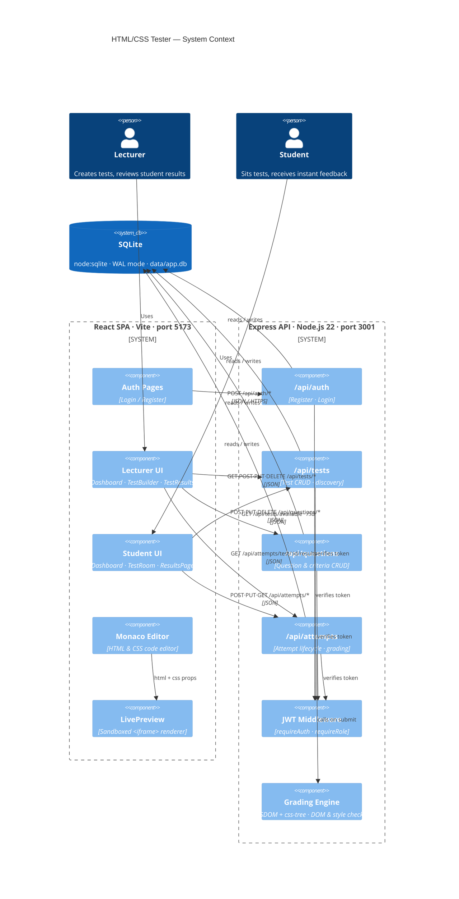
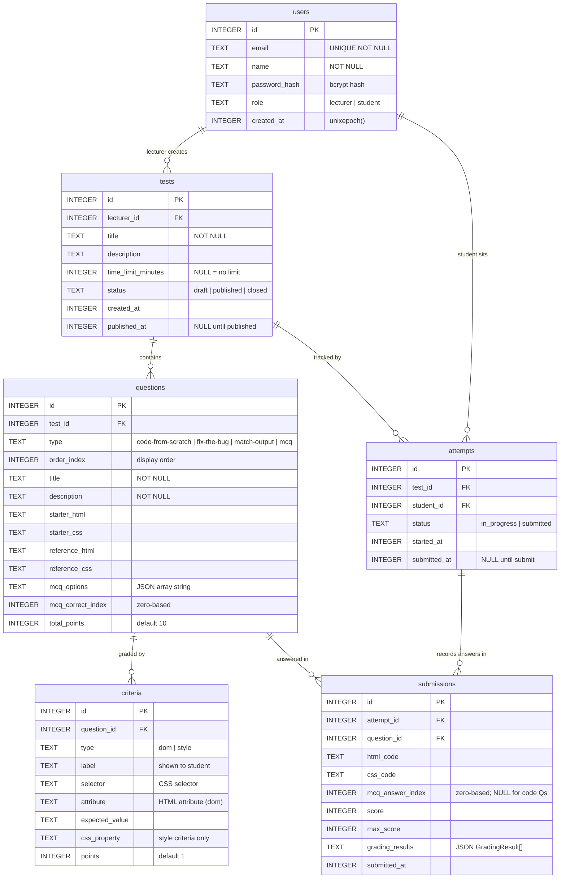
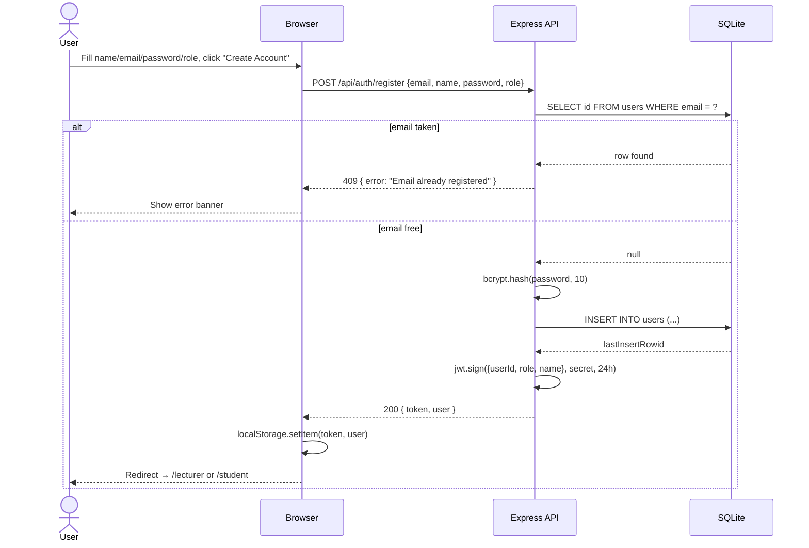
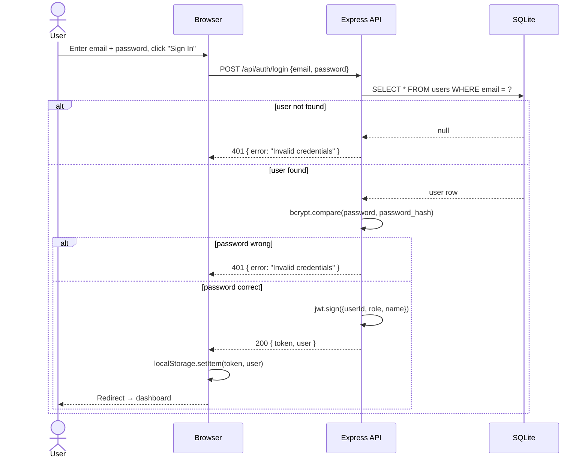
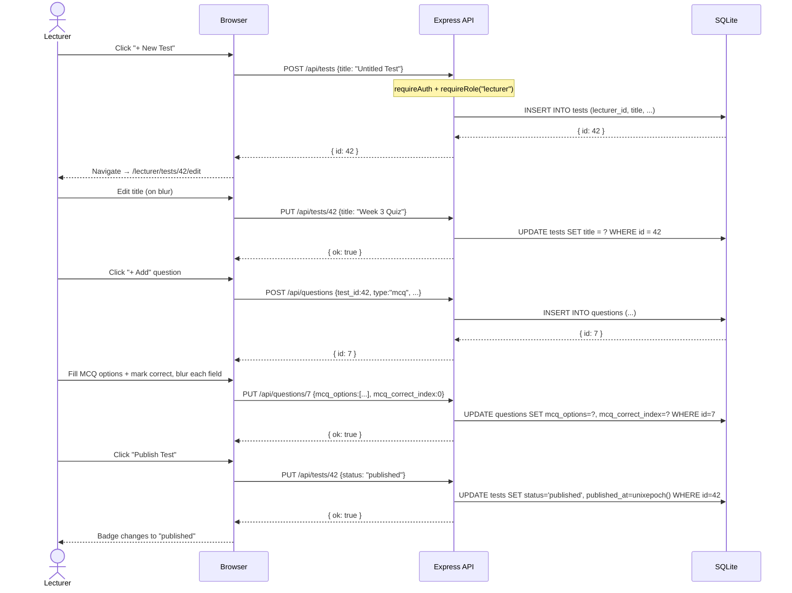
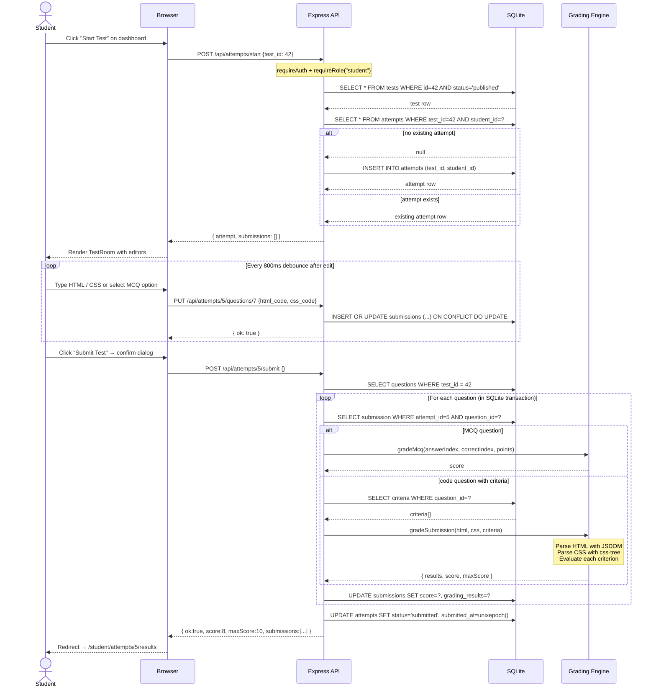
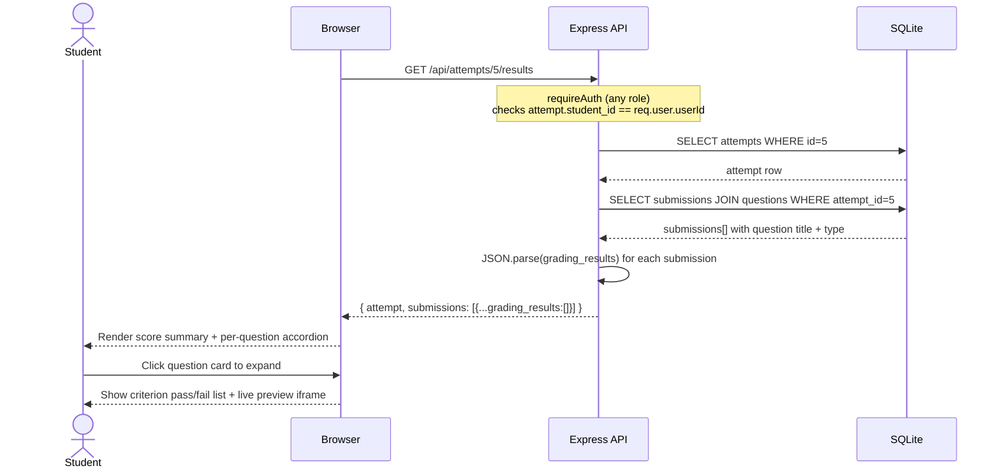
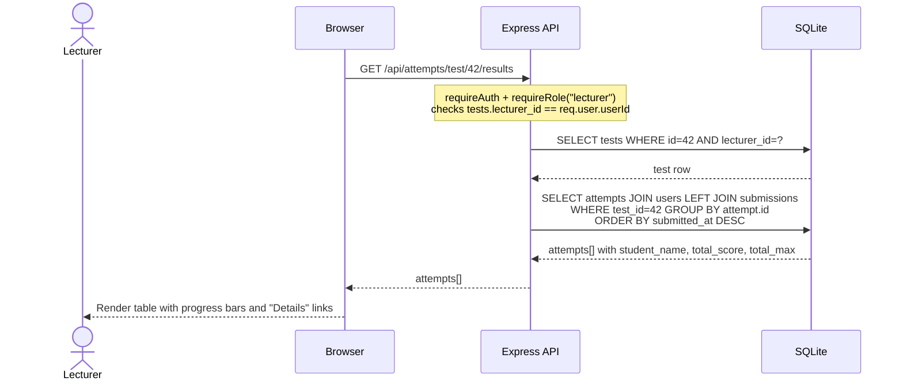

# Architecture Diagrams

---

## 1. Architecture Context Diagram

Shows the major system components and how they communicate.

---

## 2. Entity Relationship Diagram

Database schema managed by `server/src/db/sql.ts`. All timestamps are Unix epoch integers.

**Key constraints**

| Table                                           | Constraint                                                       |
| ----------------------------------------------- | ---------------------------------------------------------------- |
| `users.email`                                   | `UNIQUE`                                                         |
| `attempts`                                      | `UNIQUE(test_id, student_id)` — one attempt per student per test |
| `submissions`                                   | `UNIQUE(attempt_id, question_id)` — upserted on each auto-save   |
| `tests`, `questions`, `criteria`, `submissions` | `ON DELETE CASCADE` on FK to parent                              |

---

## 3. Sequence Diagrams

### 3a. User Registration

---

### 3b. User Login

---

### 3c. Lecturer Creates and Publishes a Test

---

### 3d. Student Takes a Test

---

### 3e. Student Views Results

---

### 3f. Lecturer Views All Student Results

---

## 4. Use Case Diagram

Shows every user-visible capability grouped by actor and feature area.

```mermaid
flowchart TB
    %% ── Actors ────────────────────────────────────────────────────
    Lecturer(["👤 Lecturer"])
    Student(["👤 Student"])

    %% ── System boundary ───────────────────────────────────────────
    subgraph SYS["System — HTML/CSS Tester"]

        subgraph AUTH["Authentication"]
            direction TB
            UC_REG(["Register account"])
            UC_LOG(["Login"])
            UC_OUT(["Logout"])
        end

        subgraph TM["Test Management  〔Lecturer〕"]
            direction TB
            UC_CT(["Create test"])
            UC_ET(["Edit test metadata\n(title · description · time limit)"])
            UC_PUB(["Publish test"])
            UC_CLO(["Close test"])
            UC_DT(["Delete test"])
        end

        subgraph QM["Question Management  〔Lecturer〕"]
            direction TB
            UC_AQ(["Add question"])
            UC_EQ(["Edit question"])
            UC_MCQ(["Configure MCQ options\n& correct answer"])
            UC_AC(["Add grading criterion\n(DOM / CSS style)"])
            UC_DC(["Delete criterion"])
            UC_DQ(["Delete question"])
        end

        subgraph RP["Reporting  〔Lecturer〕"]
            direction TB
            UC_VR(["View class results"])
            UC_VA(["View student\nattempt detail"])
        end

        subgraph TT["Test Taking  〔Student〕"]
            direction TB
            UC_BR(["Browse available tests"])
            UC_ST(["Start test"])
            UC_RS(["Resume in-progress test"])
            UC_AN(["Answer MCQ question"])
            UC_CD(["Write HTML / CSS code"])
            UC_LP(["View live preview"])
            UC_SB(["Submit test"])
            UC_VW(["View own results"])
        end

        subgraph AUTO["Automated Behaviours"]
            direction TB
            UC_AS(["Auto-save answers"])
            UC_GR(["Grade submission"])
            UC_TL(["Enforce time limit\n& auto-submit"])
        end

    end

    %% ── Lecturer associations ──────────────────────────────────────
    Lecturer --- UC_REG
    Lecturer --- UC_LOG
    Lecturer --- UC_OUT
    Lecturer --- UC_CT
    Lecturer --- UC_ET
    Lecturer --- UC_PUB
    Lecturer --- UC_CLO
    Lecturer --- UC_DT
    Lecturer --- UC_AQ
    Lecturer --- UC_EQ
    Lecturer --- UC_MCQ
    Lecturer --- UC_AC
    Lecturer --- UC_DC
    Lecturer --- UC_DQ
    Lecturer --- UC_VR
    Lecturer --- UC_VA

    %% ── Student associations ───────────────────────────────────────
    Student --- UC_REG
    Student --- UC_LOG
    Student --- UC_OUT
    Student --- UC_BR
    Student --- UC_ST
    Student --- UC_RS
    Student --- UC_AN
    Student --- UC_CD
    Student --- UC_LP
    Student --- UC_SB
    Student --- UC_VW

    %% ── <<include>> relationships ──────────────────────────────────
    UC_ST    -. "<<include>>" .-> UC_AS
    UC_RS    -. "<<include>>" .-> UC_AS
    UC_AN    -. "<<include>>" .-> UC_AS
    UC_CD    -. "<<include>>" .-> UC_AS
    UC_SB    -. "<<include>>" .-> UC_GR
    UC_MCQ   -. "<<include>>" .-> UC_AQ
    UC_VA    -. "<<include>>" .-> UC_VR

    %% ── <<extend>> relationships ───────────────────────────────────
    UC_LP    -. "<<extend>>" .-> UC_CD
    UC_AC    -. "<<extend>>" .-> UC_AQ
    UC_TL    -. "<<extend>>" .-> UC_ST

    %% ── Styling ────────────────────────────────────────────────────
    classDef actor    fill:#dbeafe,stroke:#2563eb,color:#1e3a5f,font-weight:bold
    classDef usecase  fill:#f0fdf4,stroke:#16a34a,color:#14532d
    classDef auto     fill:#fef9c3,stroke:#ca8a04,color:#713f12

    class Lecturer,Student actor
    class UC_REG,UC_LOG,UC_OUT,UC_CT,UC_ET,UC_PUB,UC_CLO,UC_DT usecase
    class UC_AQ,UC_EQ,UC_MCQ,UC_AC,UC_DC,UC_DQ,UC_VR,UC_VA usecase
    class UC_BR,UC_ST,UC_RS,UC_AN,UC_CD,UC_LP,UC_SB,UC_VW usecase
    class UC_AS,UC_GR,UC_TL auto
```

`<<include>>` means the base use case always triggers the included one.
`<<extend>>` means the extension is conditionally triggered.

### Use case index

| ID     | Use Case                               | Actor(s)          | Notes                                                                  |
| ------ | -------------------------------------- | ----------------- | ---------------------------------------------------------------------- |
| UC_REG | Register account                       | Lecturer, Student | Role selected at registration                                          |
| UC_LOG | Login                                  | Lecturer, Student | Returns JWT; role-based redirect                                       |
| UC_OUT | Logout                                 | Lecturer, Student | Clears localStorage session                                            |
| UC_CT  | Create test                            | Lecturer          | Creates draft; navigates to editor                                     |
| UC_ET  | Edit test metadata                     | Lecturer          | Title, description, time limit — saved on blur                         |
| UC_PUB | Publish test                           | Lecturer          | Sets `status = "published"`; records `published_at`                    |
| UC_CLO | Close test                             | Lecturer          | Sets `status = "closed"`; hides from students                          |
| UC_DT  | Delete test                            | Lecturer          | Cascades to questions, attempts, submissions                           |
| UC_AQ  | Add question                           | Lecturer          | Types: code-from-scratch, fix-the-bug, match-output, mcq               |
| UC_EQ  | Edit question                          | Lecturer          | Fields saved on blur via PUT                                           |
| UC_MCQ | Configure MCQ options & correct answer | Lecturer          | `<<include>>` UC_AQ — shown only when type = mcq                       |
| UC_AC  | Add grading criterion                  | Lecturer          | `<<extend>>` UC_AQ — dom or style check                                |
| UC_DC  | Delete criterion                       | Lecturer          |                                                                        |
| UC_DQ  | Delete question                        | Lecturer          | Cascades to criteria and submissions                                   |
| UC_VR  | View class results                     | Lecturer          | Aggregated attempts table with avg score                               |
| UC_VA  | View student attempt detail            | Lecturer          | `<<include>>` UC_VR — per-criterion breakdown                          |
| UC_BR  | Browse available tests                 | Student           | Shows attempt status per test card                                     |
| UC_ST  | Start test                             | Student           | Creates attempt; `<<include>>` UC_AS                                   |
| UC_RS  | Resume in-progress test                | Student           | Reloads saved answers; `<<include>>` UC_AS                             |
| UC_AN  | Answer MCQ question                    | Student           | Selects option; `<<include>>` UC_AS                                    |
| UC_CD  | Write HTML / CSS code                  | Student           | Monaco editor; `<<include>>` UC_AS                                     |
| UC_LP  | View live preview                      | Student           | `<<extend>>` UC_CD — sandboxed iframe, always visible alongside editor |
| UC_SB  | Submit test                            | Student           | `<<include>>` UC_GR — locks attempt permanently                        |
| UC_VW  | View own results                       | Student           | Score summary + per-criterion accordion                                |
| UC_AS  | Auto-save answers                      | System            | Debounced 800 ms; upsert via PUT                                       |
| UC_GR  | Grade submission                       | System            | MCQ: index compare; code: JSDOM + css-tree per criterion               |
| UC_TL  | Enforce time limit & auto-submit       | System            | `<<extend>>` UC_ST — active only when `time_limit_minutes` is set      |
